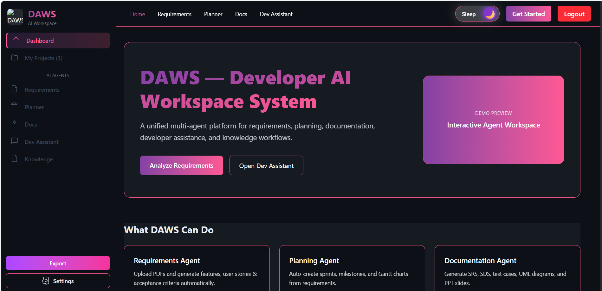
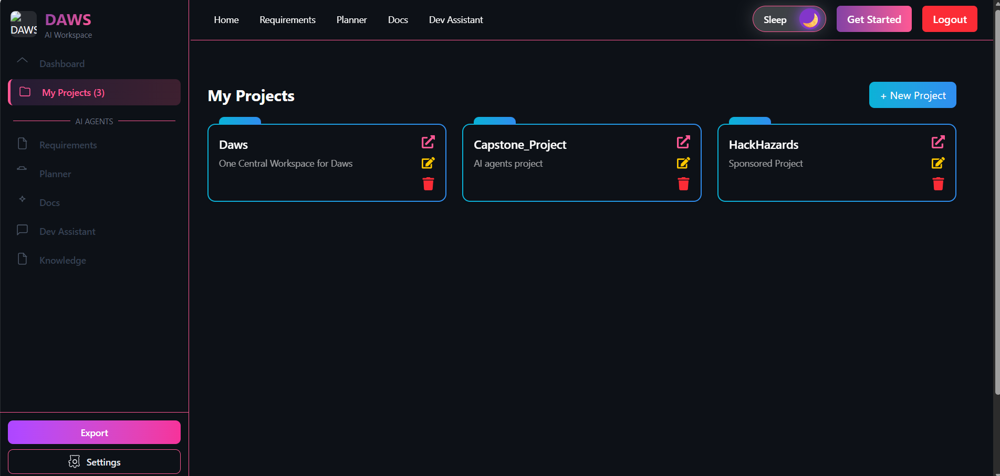
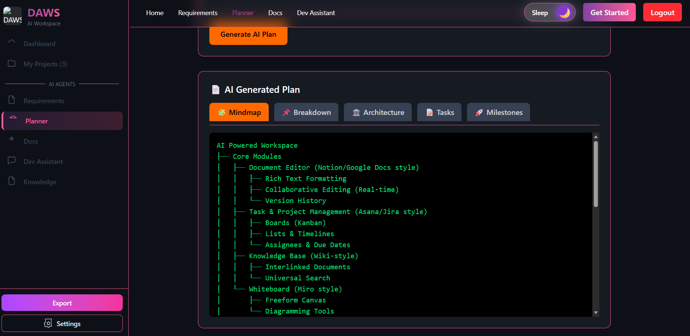
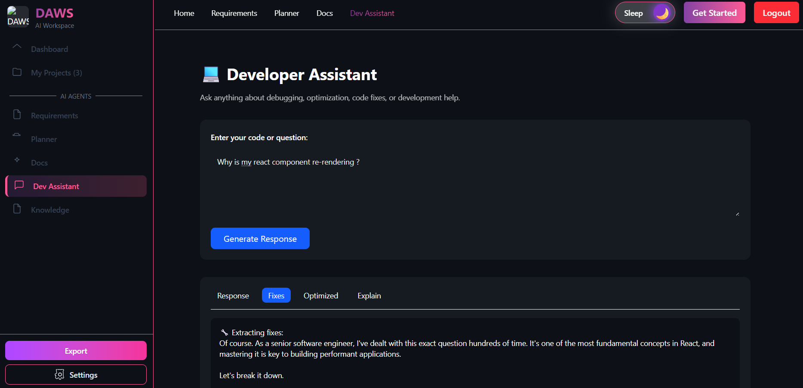
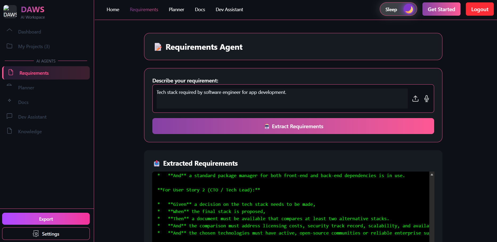
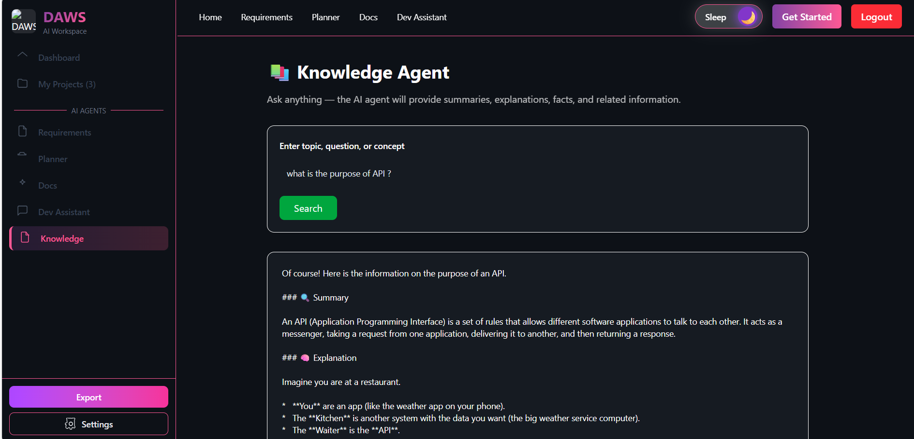

.jpg>)

# 🚀 Project Title

### DAWS (Developer AI Workspace System)

**"One Central Workspace for All Stages of App/Web Development"**

## Table of Contents

- [Project Overview](#project-overview)
- [Problem Statement](#problem-statement)
- [Solution](#solution)
- [Key Features](#key-features)
- [Architecture](#architecture)
- [Technologies Used](#🛠️ Tech Stack)
- [Setup & Installation](# How to Run the Project)
- [Folder Structure](#📁 Folder Structure)
- [Usage](#usage)
- [Screenshots / Diagrams](#Project Showcase)
- [Contributing](#contributing)
- [License](#license)

---

## Project Overview

**DAWS** is a unified platform for software development teams that integrates multiple tools into a single dashboard. It streamlines the development workflow by combining task management, documentation, design, code assistance, and collaboration tools, reducing context-switching and increasing productivity.

---

## Problem Statement

Modern software teams face a fragmented workflow, using multiple tools simultaneously:

- **Task Management:** Jira
- **Documentation:** Confluence / Notion / Google Docs
- **Design Collaboration:** Figma
- **Presentations:** Google Slides
- **Coding Assistance:** ChatGPT / Gemini
- **Version Control & Issues:** GitHub

**Challenges faced:**

- Constant switching between tools reduces productivity.
- Manual updates across tools lead to inconsistencies.
- Difficulty tracking progress across multiple platforms.
- Slower requirement-to-delivery cycles due to fragmented workflows.

---

## Solution

DAWS solves this by providing a **centralized workspace** that integrates these tools into one unified interface. Key benefits:

- **Single Dashboard:** Access tasks, docs, designs, and AI assistance in one place.
- **Automated Sync:** Updates in one tool reflect across others automatically.
- **Collaboration:** Real-time notifications and team communication inside the platform.
- **AI Assistance:** Code suggestions, requirement analysis, and documentation help.

---

## Key Features

1. **Task Management Integration** – Sync Jira tasks directly.
2. **Documentation Hub** – Connect Notion and Google Docs.
3. **Design Integration** – View and comment on Figma files.
4. **Code Assistance** – AI-driven code suggestions and documentation.
5. **Notifications & Alerts** – Stay updated on project progress.
6. **Analytics Dashboard** – Visualize team performance and timelines.

---

## 🛠️ Tech Stack

### Core Technologies Used:

- **Frontend:** React + TypeScript , Tailwind CSS
- **Backend:** Node.js , Express.js
- **Database:** MySQL2
- **UI/UX Designing:** Figma
- **APIs:** Authentication API , Agents APIs , CRUD API for projects
- **Deployment:** Render(Frontend , backend) , Railway(MySQL)

## How to Run the Project

### Requirements:

- Node.js / React / MySQL
- API Keys (GEMINI_API_KEY)
- .env file setup (if needed)

### Local Setup Instruction:

**1. Clone**

```bash
git clone https://github.com/DevloperMahak/AI_Project.git
```

**2. Backend Setup**

```bash
cd backend
npm install
```

Create .env:

```bash
GEMINI_API_KEY=your_key_here
```

Run backend:

```bash
npm start
```

**2. Frontend Setup**

```bash
cd frontend/DAWS
npm install
npm run dev
```

---

## 📁 Folder Structure

```bash

DAWS/
│
├── backend/
│   ├── controllers/
│   │   ├──
│   │   ├── requirementsController.js
│   │   ├── planningController.js
│   │   └── documentationController.js
│   ├── routes/
│   │   └── agentsRoutes.js
│   ├── services/
│   │   └── llmService.js
│   ├── server.js
│   └── package.json
│
└── frontend/
    ├── src/
    │   ├── agents/
    │   │   ├── RequirementsAgent.tsx
    │   │   ├── PlannerAgent.tsx
    │   │   └── DocsAgent.tsx
    │   ├── utils/
    │   │   └── agentsApi.ts
    │   └── App.tsx
    ├── package.json
```

## Project Showcase












